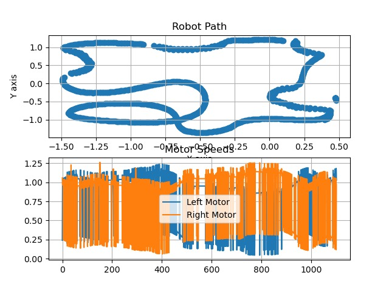
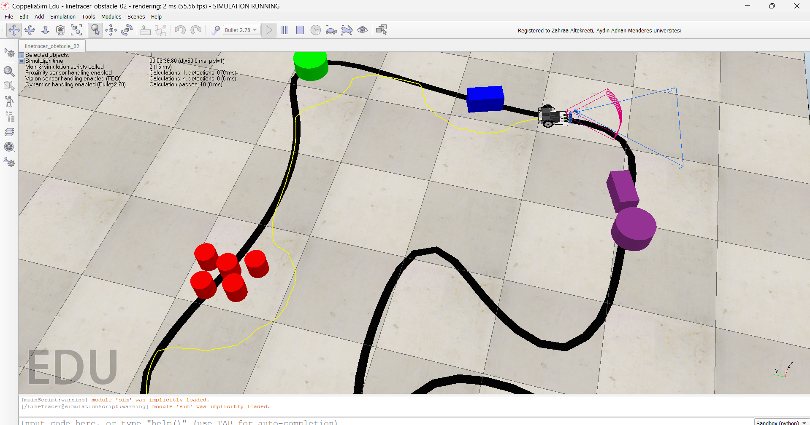
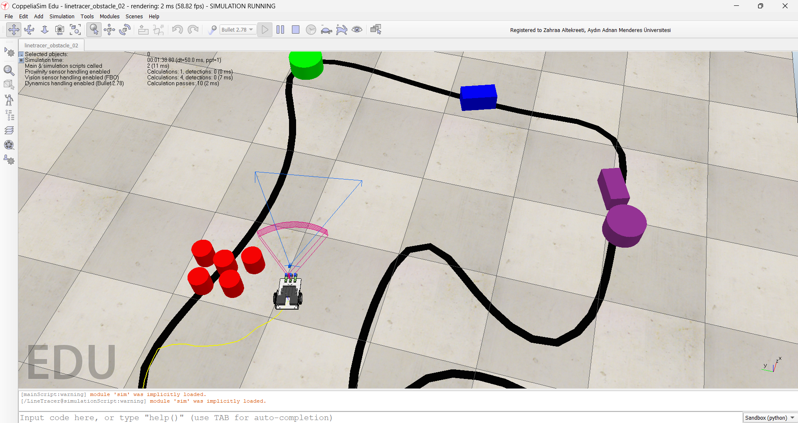

# Line-Following Robot with Adaptive Obstacle Avoidance

This project implements a simulation for an autonomous mobile robot using CoppeliaSim and Python. The robot follows a line using IR sensors and adapts to avoid obstacles dynamically, featuring PID control and lap time tracking.

## 📌 Features
- Line Following with PID Control
- Adaptive Obstacle Avoidance (Right-side Detour)
- Lap Time Calculation
- Visualization of Path and Motor Speeds
- State Transition Debug Outputs

## 🧠 Technologies Used
- Python 3.x
- OpenCV
- NumPy
- Matplotlib
- CoppeliaSim ZMQ Remote API

## 🚀 Running the Code
Make sure CoppeliaSim is running and ZMQ Remote API is enabled.

## 📸 Screenshots

### 🔹 Robot Following the Line

### 🔹 Obstacle Avoidance in Action

